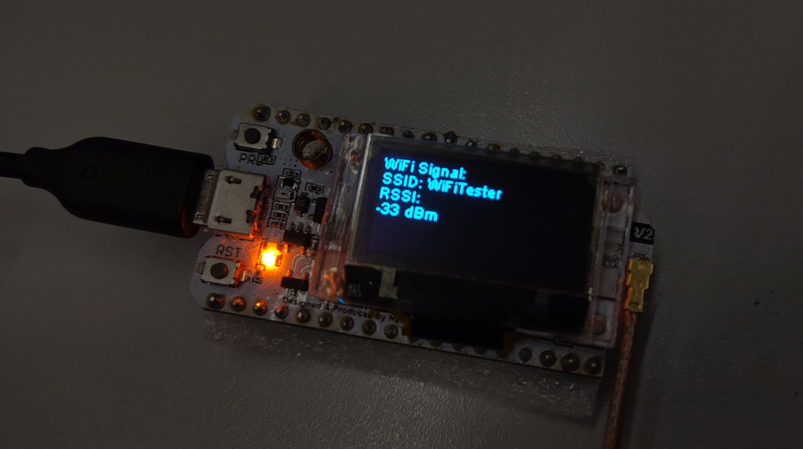

# WiFiTester

WiFiTester is a versatile tool designed for the Heltec WiFi LoRa 32 V2 board that measures WiFi signal strength and communicates this information to a designated MQTT broker. You can also switch off MQTT if you don't want to use it. See the `config.json` for this (more [HERE](#Configuration)). Additionally, it utilizes the board's built-in OLED display to provide a visual representation of the WiFi signal quality. This project is particularly useful for those looking to evaluate and monitor their wireless network's performance in different locations or for IoT applications requiring reliable WiFi connectivity.



## Features

- Measures WiFi signal strength (RSSI).
- Displays WiFi signal strength and SSID on the OLED.
- Sends WiFi signal strength data to an MQTT broker.
- Customizable MQTT topic and broker settings.

## Requirements

- Heltec WiFi LoRa 32 V2 board.
- PlatformIO CLI or PlatformIO IDE for building and uploading the firmware.
- Nix package manager for setting up a reproducible development environment (optional).

Stay tuned for further sections, which will guide you through the installation, configuration, and usage of this project step by step.

## Configuration

To tailor the WiFiTester to your specific environment, a personalized configuration is required. This is accomplished through a `config.json` file, which you need to create in the `./data` directory of the project.

### Setting up the Configuration File

1. Navigate to the `./data` directory within your project.
2. You'll find a template file named `config.json-template`. Use this as the base for your configuration.
3. Create a new file called `config.json` in the same directory.
4. Copy the contents from `config.json-template` to your new `config.json` file.

### Configuration Options

The `config.json` file consists of several key-value pairs that determine the behavior of the WiFiTester. Here's a breakdown of the available settings:

- `system.interval`: The time interval (in milliseconds) at which the WiFi signal strength is measured and sent to the MQTT broker.
- `wifi.ssid`: The SSID of the WiFi network you want the device to connect to.
- `wifi.password`: The password for the WiFi network specified by `wifi.ssid`.

For the MQTT communication settings:

- `mqtt.enabled`: A boolean value that enables (`1`) or disables (`0`) the MQTT functionality.
- `mqtt.host`: The hostname or IP address of the MQTT broker.
- `mqtt.port`: The port number on which the MQTT broker is listening (default is `1883`).
- `mqtt.user`: The username required to authenticate with the MQTT broker.
- `mqtt.password`: The password required to authenticate with the MQTT broker.
- `mqtt.topic`: The MQTT topic under which the WiFi signal strength data will be published.

### Example

Here is an example of what your `config.json` file might look like:

```json
{
    "system": {
        "interval": 10000
    },
    "wifi": {
        "ssid": "your_wifi_ssid",
        "password": "your_wifi_password"
    },
    "mqtt": {
        "enabled": 1,
        "host": "your_mqtt_host",
        "port": 1883,
        "user": "your_mqtt_user",
        "password": "your_mqtt_password",
        "topic": "your_mqtt_topic"
    }
}
```

Make sure to replace the placeholder values (`your_wifi_ssid`, `your_wifi_password`, `your_mqtt_host`, etc.) with your actual network and MQTT broker information.

After setting up the `config.json` file, the WiFiTester will read the configuration at startup and behave according to the specified settings.

## Flashing the Board

Flashing the Heltec WiFi LoRa 32 V2 board with the WiFiTester firmware involves a few steps which are streamlined by using the Makefile. If you are using Nix, the process ensures that you have a consistent development environment.

### Using Nix Shell

For those who prefer a reproducible development environment, `nix-shell` is used to enter a shell session with all the necessary dependencies pre-installed.

1. Ensure you have Nix installed on your system. For installation instructions, visit the [NixOS download page](https://nixos.org/download.html).
2. Navigate to the root of the WiFiTester project directory.
3. Run the following command to enter the Nix shell:

   ```shell
   make shell
   ```

   This will set up the environment defined in your `shell.nix` file.

### Falshing using the binaries from the releases section
In the [release section](https://github.com/Friedjof/WifiTester/releases), you can find the latest binary files for the esp32. You can use the following commands to flash the binary files to the `ESP32` microcontroller.
You may need to adjust the `--port` parameter to match your system configuration.

You need to install the esptool first.
```bash
pip install esptool
```

#### firmware.bin, bootloader.bin and partitions.bin
```bash
esptool.py --port /dev/ttyUSB0 --baud 921600 --before default_reset --after hard_reset write_flash -z --flash_mode dio --flash_freq 40m --flash_size detect 0x1000 bootloader.bin 0x8000 partitions.bin 0x10000 firmware.bin
```

#### littlefs.bin
```bash
esptool.py --port /dev/ttyUSB0 --baud 921600 --before default_reset --after hard_reset write_flash -z --flash_mode dio --flash_freq 40m --flash_size detect 0x290000 littlefs.bin
```

### Flashing using the Makefile (from source)

The Makefile contains predefined commands that facilitate building and flashing the firmware onto your board.

1. **Build the Project:**

   To compile the project and create the necessary firmware binaries, run:

   ```shell
   make build
   ```

2. **Flash the Firmware:**

   Once the build is successful, you can flash the firmware to your ESP32 board by running:

   ```shell
   make flash
   ```

   Ensure that your board is connected to the computer via the USB port. You may need to adjust the `UPLOAD_PORT` in the Makefile to match the port name assigned to your board.

3. **Monitor Serial Output:**

   After flashing, you can watch the serial output to ensure the board is functioning correctly:

   ```shell
   make monitor
   ```

   Adjust the `UPLOAD_SPEED` in the Makefile if your board uses a different baud rate.

### Uploading Filesystem Image (SPIFFS)

If your application uses SPIFFS for storing the configuration file or other data:

1. **Create the SPIFFS Image:**

   First, you need to build the SPIFFS image from the contents of the `./data` directory:

   ```shell
   make fs
   ```

2. **Upload the SPIFFS Image:**

   To upload the SPIFFS image to your board, run:

   ```shell
   make uploadfs
   ```

### Full Workflow Commands

- To build and flash everything in one go, use:

  ```shell
  make start
  ```

- To re-upload the SPIFFS and restart monitoring, use:

  ```shell
  make reupload
  ```

- To flash the firmware and start monitoring without touching the SPIFFS, use:

  ```shell
  make reload
  ```

By following these steps, you can flash the WiFiTester firmware onto your Heltec WiFi LoRa 32 V2 board and have it up and running in no time.

## Support and Contribution

Your contributions to improve WiFiTester are welcome and appreciated. Whether it is suggesting new features, reporting bugs, or improving the documentation, your input helps make this project better for everyone.

### Reporting Issues

If you encounter any issues while setting up or using WiFiTester, please open an issue on the project's GitHub repository. Provide as much detail as possible, such as:

- The steps to reproduce the issue.
- Any error messages that were displayed.
- The expected outcome and the actual outcome.

### Contributing to the Project

To contribute code or documentation to WiFiTester, please follow these steps:

1. Fork the repository on GitHub.
2. Create a new branch for your feature or bug fix.
3. Develop and test your changes.
4. Submit a pull request with a clear description of the changes.

Please ensure your code adheres to the existing style of the project to maintain consistency.

### License

This project is licensed under the [MIT License](LICENSE.md) - see the LICENSE file for details.

### Acknowledgments

Special thanks to everyone who has contributed to the development and maintenance of WiFiTester. Your support and involvement have been instrumental to the project's success.

We look forward to seeing how WiFiTester evolves with your contributions and feedback.

## Getting Help

If you need help with setting up or using WiFiTester, please reach out to the community on [our forum](https://matrix.to/#/!myHiqKhSGIVJjiAVUf:matrix.org?via=matrix.org).

Thank you for using and contributing to WiFiTester!
